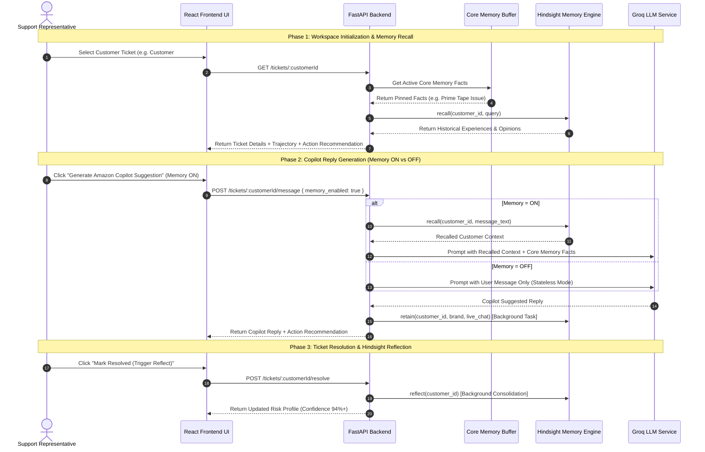

# System Architecture & Technical Specifications

This document outlines the complete architectural design, entity-relationship schemas, and workflow execution pipelines for the **Hindsight Support Memory & Escalation Copilot**.

---

## 1. Entity-Relationship (ER) Diagram

The ER diagram defines the relational data structures and entity dependencies across the customer workspace, memory engines, risk profiles, and action recommendation services.

```mermaid
erDiagram
    CUSTOMER ||--o{ THREAD : has
    CUSTOMER ||--o| HELDOUT_THREAD : active
    CUSTOMER ||--o| ORDER_DETAILS : has
    CUSTOMER ||--o| RISK_PROFILE : possesses
    CUSTOMER ||--o| FRUSTRATION_TRAJECTORY : tracks
    CUSTOMER ||--o{ CORE_MEMORY_FACT : pins
    CUSTOMER ||--o{ RECALLED_ITEM : recalls

    THREAD ||--o{ MESSAGE : contains
    HELDOUT_THREAD ||--o{ MESSAGE : contains
    FRUSTRATION_TRAJECTORY ||--o{ FRUSTRATION_SESSION : includes

    CUSTOMER {
        string customer_id PK "Unique identifier (e.g. cust_0001)"
        string display_label "Pseudonymized label (SRS FR-11)"
        string brand_handle "Target brand (AmazonHelp)"
    }

    ORDER_DETAILS {
        string order_id PK "Order number (302-XXXX-XXXX)"
        string item_name "Purchased product name"
        string price "Product price ($XX.XX)"
        string membership_tier "Prime or Standard Shipping"
        string tracking_status "Carrier delivery status"
    }

    RISK_PROFILE {
        string customer_id FK "Customer ID reference"
        int contact_count_this_issue "Total support contacts"
        string sentiment_trend "declining | stable | improving"
        float confidence "Algorithm confidence score (0.0 - 1.0)"
        string risk_level "normal | watch | escalate"
    }

    FRUSTRATION_TRAJECTORY {
        string customer_id FK "Customer ID reference"
        string overall_trend "increasing | stable | decreasing"
        int current_frustration_score "Distress score percentage (0-100)"
        string current_frustration_level "Low | Medium | High | Critical"
    }

    FRUSTRATION_SESSION {
        string session_id PK "Unique session thread ID"
        string session_label "Session label (e.g. Session #1)"
        string timestamp "Session start timestamp"
        int frustration_score "Session distress score"
        string frustration_level "Session frustration tier"
        string summary_reason "Dynamic message topic snippet"
    }

    AGENT_ACTION_RECOMMENDATION {
        string action_type "escalate_manager | issue_goodwill | verify_details | standard_resolution"
        string headline "High-contrast action headline"
        string recommended_action "Concrete recommended next step"
        string rationale "Memory and distress trajectory rationale"
        float confidence "Matching confidence score"
    }

    CORE_MEMORY_FACT {
        string id PK "Unique fact ID"
        string customer_id FK "Customer ID reference"
        string text "Pinned working memory constraint"
        string category "Packaging | Churn Risk | Quality"
        string timestamp "Timestamp when pinned"
    }

    RECALLED_ITEM {
        string type "experience | opinion"
        string summary "Hindsight memory recall text"
        string timestamp "Historical occurrence timestamp"
        float confidence "Recall confidence score"
    }

    THREAD {
        string thread_id PK "Historical thread ID"
        string customer_id FK "Customer ID reference"
        string timestamp_start "Thread start timestamp"
    }

    HELDOUT_THREAD {
        string thread_id PK "Live ticket thread ID"
        string customer_id FK "Customer ID reference"
    }

    MESSAGE {
        string role "customer | brand"
        string text "Message transcript body"
        string timestamp "ISO 8601 timestamp"
    }
```



---

## 2. End-to-End System Workflow Diagram

The workflow diagram details the complete operational lifecycle from ticket selection, Memory ON/OFF evaluation, semantic Hindsight recall, Groq LLM fallback execution, background retention, and ticket resolution reflection.

```mermaid
flowchart TD
    subgraph Client ["Client Layer (React / Vite)"]
        A1["Support Agent Selects Ticket"] --> A2["Render Ticket Queue & Order Context"]
        A3["Toggle Memory ON / OFF"] --> A4["Submit Query / Click Generate Reply"]
        A5["Click 'Mark Resolved'"] --> A6["Display Reflect Success & Risk Update"]
    end

    subgraph API ["API Gateway Layer (FastAPI)"]
        B1["GET /tickets/:customerId"]
        B2["POST /tickets/:customerId/message"]
        B3["POST /tickets/:customerId/resolve"]
    end

    subgraph BusinessLogic ["Core Processing Engines"]
        C1["Customer & Order Cache Engine"]
        C2["MemGPT Core Memory Buffer<br/>(Working Memory Facts)"]
        C3["Frustration Trajectory Engine<br/>(Multi-Session Distress Score)"]
        C4["Action Recommendation Engine<br/>(Topic Classifier)"]
        C5["Groq LLM Service<br/>(NFR-2 Resilient Executor)"]
    end

    subgraph MemoryBank ["Hindsight Memory Engine"]
        D1["Recall Engine<br/>filter_by(customer_id)"]
        D2["Retain Engine<br/>Async Background Worker"]
        D3["Reflect Engine<br/>Memory Consolidation Loop"]
    end

    subgraph LLMInfra ["Inference Models (Groq API)"]
        E1["Primary Model<br/>openai/gpt-oss-120b"]
        E2["Fallback Model<br/>qwen/qwen3-32b"]
        E3["Degraded String Fallback"]
    end

    %% Workflow Connections
    A1 -->|HTTP GET| B1
    B1 --> C1
    B1 --> C2
    B1 --> C3
    B1 --> C4
    C3 -->|Calculate Multi-Session Trend| A2
    C4 -->|Generate Next Action Advisory| A2

    A4 -->|HTTP POST| B2
    B2 -->|Fetch Pinned Facts| C2
    
    B2 -->|Memory = OFF| C5
    B2 -->|Memory = ON| D1
    D1 -->|Return Filtered Memories| C5

    C5 -->|Attempt 1: Call Primary| E1
    E1 -- Success --> B2
    E1 -- Error / Timeout -->|Attempt 2: Retry Primary| E1
    E1 -- Fail 2x -->|Attempt 3: Swappable Fallback| E2
    E2 -- Success --> B2
    E2 -- Fail --> E3 --> B2

    B2 -->|Async Background Task| D2
    D2 -->|Persist Live Chat| MemoryBank

    A5 -->|HTTP POST| B3
    B3 -->|Trigger Reflection| D3
    D3 -->|Consolidate Experience into Opinion| MemoryBank
    B3 -->|Update Confidence to 94%+| A6
```

---

## 3. Sequential Execution Blueprint

Below is the step-by-step sequence diagram illustrating real-time interaction between the agent, backend services, vector memory bank, and inference models.



---

## 4. Key Architectural Safeguards & Constraints

1. **Per-Customer Isolation**: Every Hindsight `retain` call includes `{ customer_id, brand }`, and every `recall` call filters strictly by `customer_id`.
2. **NFR-2 Groq Resilience**: Primary `openai/gpt-oss-120b` $\rightarrow$ Single Retry $\rightarrow$ Fallback `qwen/qwen3-32b` $\rightarrow$ Degraded fallback string.
3. **SRS FR-11 Compliance**: Pseudonymized `display_label` ("Customer #8220") used everywhere in UI, logs, and generated assets to ensure zero real Twitter handles are exposed.
4. **FastAPI & Python Lock**: All backend code targets Python 3.10+ / FastAPI with strict Pydantic schemas.
