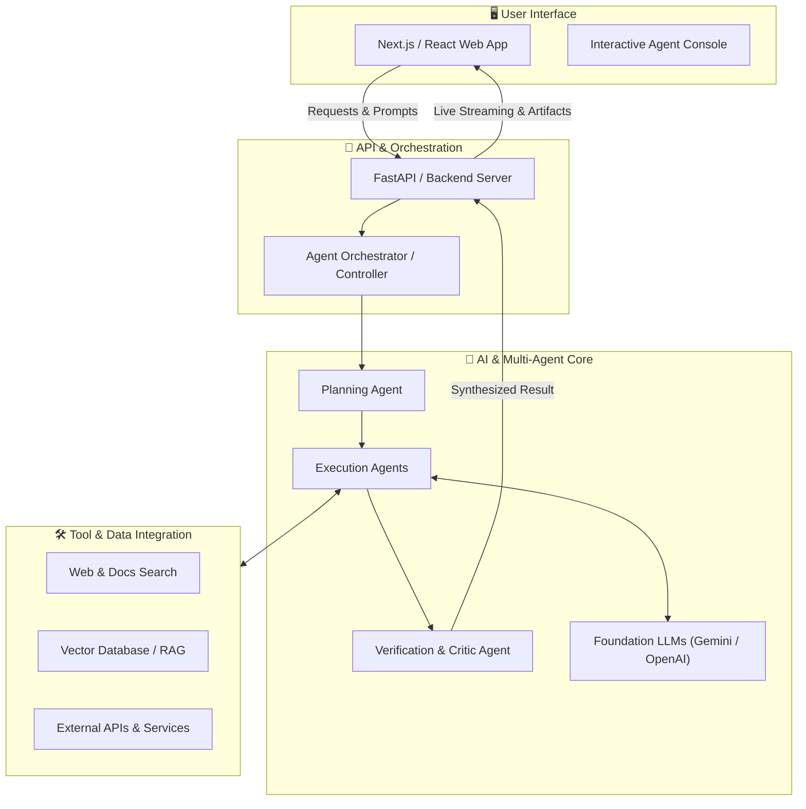

<div align="center">

# ⚡ [Project Name]
### *Next-Gen Autonomous Agent System for [Domain / Problem]*

[](https://github.com/ManiDeep1822/Hackathon)
[](https://github.com/ManiDeep1822/Hackathon)
[](https://python.org)
[](https://nextjs.org)
[](LICENSE)

<br/>

**[Live Demo](https://your-demo-url.vercel.app)** • **[Pitch Deck](https://slides.google.com)** • **[Video Walkthrough](https://youtube.com)** • **[Report Bug](https://github.com/ManiDeep1822/Hackathon/issues)**

</div>

---

## 📖 Overview

**[Project Name]** is an intelligent, multi-agent autonomous system built to solve **[Specific Problem Statement]**. By leveraging cutting-edge Generative AI models and tool-calling agents, it automates complex workflows, synthesizes multimodal inputs, and delivers real-time actionable outcomes through an intuitive web interface.

### 🎯 The Problem
- **Inefficiency & Manual Bottlenecks**: [Describe current painful manual process]
- **Information Fragmentation**: Data and decision-making are scattered across siloed sources.
- **Latency in Execution**: Delays in processing, validation, and insight generation.

### 💡 Our Solution
- **Autonomous Multi-Agent Orchestration**: Specialized sub-agents collaborate to plan, execute, and verify tasks.
- **Dynamic Tool Calling & Retrieval**: Real-time integration with external APIs, search, and knowledge bases.
- **Human-in-the-Loop Control**: Interactive UI allowing users to steer agents, review artifacts, and approve critical actions.

---

## 🏗️ System Architecture



---
.
## ✨ Key Features

- 🤖 **Autonomous Multi-Agent Swarm**: Modular agents specialized in planning, research, coding, and synthesis.
- ⚡ **Real-Time Streaming Output**: Instant token and state streaming for responsive user feedback.
- 🔍 **RAG & Context Enrichment**: Dynamic context retrieval ensuring factual, up-to-date agent outputs.
- 🛡️ **Guardrails & Verification**: Automated sanity checks and schema validation prior to final responses.
- 🎨 **Modern, Accessible UI**: Clean dark/light theme, responsive controls, and visual data representations.

---

## 🧰 Tech Stack

| Layer | Technologies |
| :--- | :--- |
| **Frontend** | Next.js 14, React, TypeScript, Tailwind CSS, Lucide Icons |
| **Backend & API** | Python 3.11+, FastAPI, Uvicorn, Pydantic |
| **AI / Agent Framework** | Google GenAI SDK, LangChain / LangGraph, LiteLLM |
| **Data & Storage** | ChromaDB / Pinecone (Vector Search), SQLite / PostgreSQL |
| **DevOps & Collaboration** | GitHub Actions, GitHub Rulesets, Docker, Vercel |

---

## 📁 Repository Structure

```text
Hackathon/
├── .github/
│   ├── pull_request_template.md    # Standard PR template for the team
│   └── rulesets/
│       └── protect-main.json       # Main branch protection configuration
├── frontend/                       # Client web application (Next.js / React)
├── backend/                        # API server & agent orchestration (FastAPI)
│   ├── agents/                     # Agent definitions and prompts
│   ├── tools/                      # External tool functions & integrations
│   └── main.py                     # Server entrypoint
├── docs/                           # Architecture docs, slides, notes
├── .env.example                    # Environment variable template
├── .gitignore                      # Git ignore patterns
└── README.md                       # Project documentation
```

---

## 🚀 Getting Started

### 1. Prerequisites
- **Git** (v2.30+)
- **Node.js** (v18+) & **npm** or **pnpm**
- **Python** (v3.10+) & **pip**
- API Keys for Foundation Models (e.g., [Google AI Studio](https://aistudio.google.com/))

### 2. Clone the Repository
```bash
git clone https://github.com/ManiDeep1822/Hackathon.git
cd Hackathon
```

### 3. Configure Environment Variables
Copy `.env.example` and populate your credentials:
```bash
cp .env.example .env
```

### 4. Running the Backend
```bash
cd backend
python -m venv venv

# Windows
venv\Scripts\activate
# macOS/Linux
# source venv/bin/activate

pip install -r requirements.txt
uvicorn main:app --reload --port 8000
```

### 5. Running the Frontend
```bash
cd frontend
npm install
npm run dev
```
Open [http://localhost:3000](http://localhost:3000) in your browser.

---

## 👥 Meet the Team

| Team Member | Role & Focus | GitHub | LinkedIn |
| :--- | :--- | :--- | :--- |
| **Mani Deep** | Team Lead & AI/Agent Architect | [@ManiDeep1822](https://github.com/ManiDeep1822) | [Profile](#) |
| **Teammate 2** | Full-Stack & Backend Integration | [@username](#) | [Profile](#) |
| **Teammate 3** | Frontend & UI/UX Specialist | [@username](#) | [Profile](#) |
| **Teammate 4** | Prompt Engineer & QA / Pitch | [@username](#) | [Profile](#) |

---

## 🤝 Team Collaboration & Git Workflow

To ensure seamless collaboration across all 4 team members without merge conflicts, follow this workflow:

### 🛡️ Branch Protection Ruleset
Direct commits and force pushes to `main` are restricted. All changes enter `main` through Pull Requests.

1. **Create a Feature Branch**:
   ```bash
   git checkout -b feature/agent-planner
   # or: git checkout -b fix/api-cors-issue
   ```
2. **Commit with Conventional Messages**:
   - `feat: add document parsing agent`
   - `fix: resolve token limit overflow in summarizer`
   - `docs: update setup instructions in README`
   - `chore: update dependencies`
3. **Push Branch and Open a Pull Request**:
   ```bash
   git push origin feature/agent-planner
   ```
4. **Merge to Main**: Self-merge or request peer review, then delete the feature branch.

> [!TIP]
> **Activating the GitHub Ruleset:**
> Go to **Repository Settings** > **Rules** > **Rulesets** > **New ruleset** > Click the three dots `...` next to Save and choose **Import a ruleset**, then select [`.github/rulesets/protect-main.json`](.github/rulesets/protect-main.json).

---

## 🏆 Hackathon Checklist & Deliverables

- [ ] Complete end-to-end user workflow prototype
- [ ] Connect multi-agent backend to responsive frontend
- [ ] Record 3-minute video demo
- [ ] Prepare slide deck (Problem, Solution, Tech Stack, Demo, Future Scope)
- [ ] Verify deployment on cloud / staging URL
- [ ] Final submission write-up and GitHub repo cleanup

---

## 📄 License

This project is licensed under the MIT License - see the [LICENSE](LICENSE) file for details.
