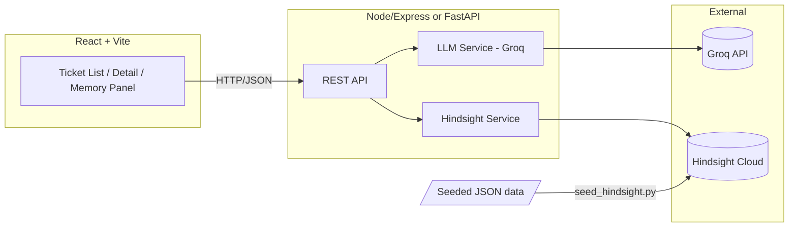

# Technical Requirements Specification (TRS)
### Support Memory Copilot

This is the binding contract for anyone's code (or Antigravity output) touching the API or data shapes. If your generated code disagrees with this doc, this doc wins — fix the code, don't quietly diverge.

## 1. Architecture



Decision: **pick ONE backend stack (Node/Express OR Python/FastAPI) before anyone writes code.** Do not let different people build backend routes in different languages. Whoever is faster in a stack, that's the stack.

## 2. Tech Stack (locked)

| Layer | Choice |
|---|---|
| Frontend | React + Vite, Tailwind (or plain CSS) |
| Backend | Node/Express *or* FastAPI — team picks one, single decision, written here once decided |
| LLM | Groq — primary `openai/gpt-oss-120b`, fallback `qwen/qwen3-32b` |
| Memory | Hindsight Cloud (hosted) |
| Storage | None beyond Hindsight + static seeded JSON — no separate DB |

## 3. Data Schemas

### 3.1 Customer object (post-filter, pre-seed)

```json
{
  "customer_id": "cust_0001",
  "display_label": "Customer #4471",
  "brand_handle": "AmazonHelp",
  "threads": [
    {
      "thread_id": "thread_001",
      "timestamp_start": "2025-08-01T10:22:00Z",
      "messages": [
        { "role": "customer", "text": "...", "timestamp": "2025-08-01T10:22:00Z" },
        { "role": "brand", "text": "...", "timestamp": "2025-08-01T10:25:00Z" }
      ]
    }
  ],
  "held_out_thread": {
    "thread_id": "thread_003",
    "messages": [ { "role": "customer", "text": "...", "timestamp": "2025-09-02T14:10:00Z" } ]
  }
}
```

`threads` = historical data seeded into Hindsight before the demo. `held_out_thread` = the "new incoming ticket" used live in the demo.

### 3.2 Risk profile object (Hindsight Opinion, mirrored in API responses)

```json
{
  "customer_id": "cust_0001",
  "contact_count_this_issue": 3,
  "sentiment_trend": "declining",
  "confidence": 0.78,
  "risk_level": "escalate"
}
```

`risk_level` ∈ `normal` | `watch` | `escalate`. Thresholds (tune during build, document final values here once fixed):
- `watch`: contact_count_this_issue ≥ 2 OR sentiment_trend = "declining"
- `escalate`: contact_count_this_issue ≥ 3 AND sentiment_trend = "declining"

### 3.3 Hindsight metadata convention

Every `retain` call for this project MUST include:

```json
{ "metadata": { "customer_id": "cust_0001", "brand": "AmazonHelp" } }
```

Every `recall` call MUST filter on `customer_id` to enforce per-customer isolation — a recall without this filter is a bug, not a feature.

## 4. API Contract

Base path: `/api`

| Method | Path | Purpose | Request body | Response body |
|---|---|---|---|---|
| GET | `/tickets` | List all seeded tickets with risk badges | — | `[{ customer_id, display_label, risk_level, last_message_preview }]` |
| GET | `/tickets/:customerId` | Full ticket detail | — | `{ customer, threads, risk_profile }` |
| POST | `/tickets/:customerId/message` | Send new message, get agent response | `{ text, memory_enabled: bool }` | `{ agent_response, recalled_context: [...] or null }` |
| GET | `/tickets/:customerId/memory` | Raw recall dump for the memory panel | — | `{ recalled_items: [...], risk_profile }` |
| POST | `/tickets/:customerId/resolve` | Trigger reflect, update risk profile | — | `{ updated_risk_profile }` |

`recalled_context` / `recalled_items` shape (from Hindsight recall, lightly formatted for display):

```json
[
  { "type": "experience", "summary": "...", "timestamp": "..." },
  { "type": "opinion", "summary": "...", "confidence": 0.78 }
]
```

## 5. Component Ownership (maps to README team table)

| Path | Owner | Notes |
|---|---|---|
| `/scripts/filter_dataset.py` | Person C | Outputs `/data/filtered_customers.json` matching §3.1 schema |
| `/scripts/seed_hindsight.py` | Person C | Reads filtered JSON, calls Hindsight `retain` per §3.3 |
| `/backend/services/hindsight.js` (or `.py`) | Person A | Wraps retain/recall/reflect, enforces `customer_id` filter |
| `/backend/services/llm.js` (or `.py`) | Person A | Groq call + retry/fallback per NFR-2 |
| `/backend/routes/*` | Person B | Implements §4 contract exactly — no field renaming |
| `/frontend/*` | Person D | Consumes §4 contract exactly |

## 6. Environment Variables (`.env.example`)

```
HINDSIGHT_API_KEY=
HINDSIGHT_BASE_URL=
HINDSIGHT_BANK_ID=
GROQ_API_KEY=
LLM_PRIMARY_MODEL=openai/gpt-oss-120b
LLM_FALLBACK_MODEL=qwen/qwen3-32b
```

## 7. Error Handling

- Any Groq call that fails on function-calling: retry once on the same model, then retry once on `LLM_FALLBACK_MODEL`, then return a plain-text degraded response (`"[agent could not complete a structured response]"`) rather than crashing the ticket view.
- Any Hindsight `recall` that times out or errors: memory panel shows `"memory temporarily unavailable"` and the agent falls back to Memory-OFF behavior for that single turn — never blocks the whole UI.

## 8. Non-Goals (technical)

- No WebSocket/streaming requirement unless trivial in the chosen framework
- No test suite requirement beyond manual demo-path verification
- No CI/CD pipeline beyond what's needed to keep the shared repo buildable
